# Pre-Requisites

[Docker Desktop](https://docs.docker.com/desktop/)
- To deploy the containers used for this api
- On __Windows__, you may get a prompt to download [WSL2 Kernel Engine](https://aka.ms/wsl2kernel) as well

[Postman](https://www.postman.com/downloads/)
- To utilize the json [collection](https://www.getpostman.com/collections/37c6351577b1f3e9d8d2) for calls to the api endpoints

# Getting Started

Clone this [repo](https://github.com/opariffazman/restful-json-api-docker.git) if you have git installed or `Code` > `Download Zip`

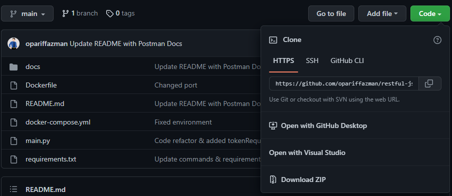

And extract its content accordingly.

```
📦restful-json-api-docker
 ┣ 📜docker-compose.yml
 ┣ 📜Dockerfile
 ┣ 📜main.py
 ┣ 📜README.md
 ┗ 📜requirements.txt
 ```
 
# Deployment

For ease of deployment, we will make use of the `Dockerfile` and `docker-compose.yml`

## For reference only 

_All of these will be included automatically during build_:

__Dockerfile__

- [Python 3.10-Slim](https://hub.docker.com/_/python)

- [Postgres 14](https://hub.docker.com/_/postgres)

__Pip requirements__

- [flask](https://flask.palletsprojects.com/en/2.1.x/) - Application Framework

- [flask sql alchemy](https://flask-sqlalchemy.palletsprojects.com/en/2.x/) - Simplify SQL Usage

- [psycopg](https://www.psycopg.org/docs/install.html) - PostgreSQL adapter

- [Werkzeug](https://werkzeug.palletsprojects.com/en/2.1.x/installation/) - Password Hashing

- [pyjwt](https://pyjwt.readthedocs.io/en/stable/) - JWT Implementation

## Docker Commands

__Ensure Docker Desktop__ is started and running on background.

Open a PowerShell session inside the root folder of this repository.

```
📦restful-json-api-docker
 ┣ 📂.git
 ┣ 📜docker-compose.yml
 ┣ 📜Dockerfile
 ┣ 📜main.py
 ┣ 📜README.md
 ┗ 📜requirements.txt
```

Run this command to start deploying the API containers with all its dependencies.
```powershell
docker compose up --build api
```

Once the shell is reporting that the api is running like below:
```powershell
api  |  * Running on http://127.0.0.1:5000
api  |  * Running on http://172.24.0.3:5000 (Press CTRL+C to quit)
```

Or you could verify on the `Docker Desktop` application > `Containers` as below:

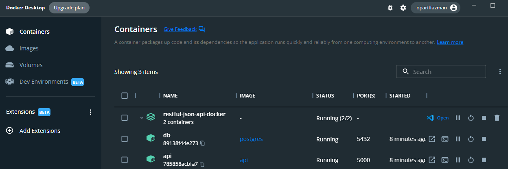

# API Usage

Open `Postman` and import the json by navigating to `Import` > `Link` > `Enter a URL` >

```
https://www.getpostman.com/collections/37c6351577b1f3e9d8d2
```

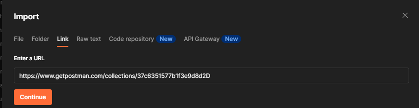
___
## create-admin

| INFO   |  |
| -------- | -------- |
| METHOD   | `POST` |
| ENDPOINT | `/api/v1/admins` |
| TOKEN    | `none` |

Provide a `name` & `password`, modify the `JSON` body information as needed > `Send`

```json
{
    "name":"admin",
    "password":"12345"
}
```

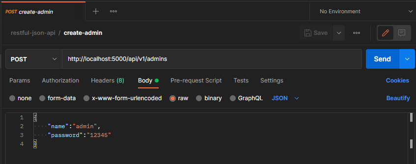
___
## admin-auth

| INFO   |  |
| -------- | -------- |
| METHOD   | `GET` |
| ENDPOINT | `/api/v1/admins/auth` |
| TOKEN    | `none` |

Use the same name & password you've created earlier > `Send`

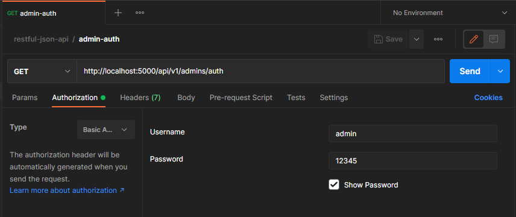

You will get a token in response in such format, copy the token (_valid for 2 minutes_) as below:

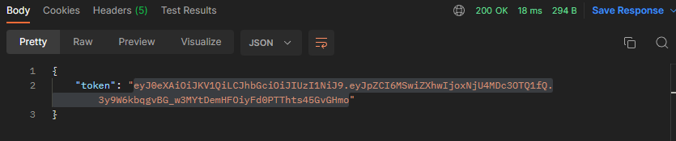

Endpoint with Token: `required` will need to be supplied with this token as key for `x-access-token` on the `Headers` for example.

### Token Related Error

Getting this __error__ when calling the API with Token required means your token is __expired__ or __incorrect__:

#### Token is invalid
```json
{
    "message": "Token is invalid!"
}
```

While this __error__ means that the `x-access-token` is not available in the `Headers` of the API call:

#### Token is missing
```json
{
    "message": "Token is missing!"
}
```

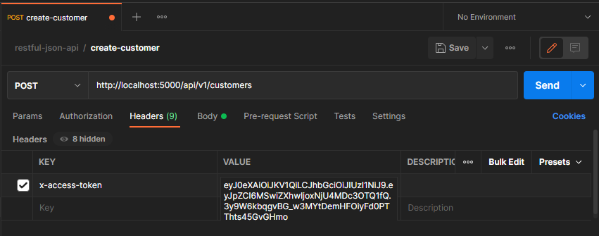
___
## create-customer

| INFO   |  |
| -------- | -------- |
| METHOD   | `POST` |
| ENDPOINT | `/api/v1/customers` |
| TOKEN    | `required` |

This endpoint will add new customer with values of `name` & `dob` (date of birth). 

Modify the `JSON` body information as needed > `Send`

```json
{
    "name":"name1",
    "dob":"2010-10-10"
}
```

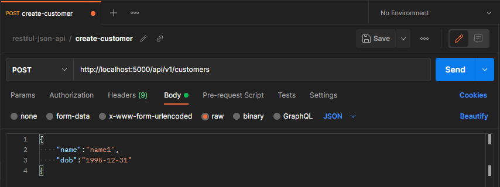
___
## get-customers

| INFO   |  |
| -------- | -------- |
| METHOD   | `GET` |
| ENDPOINT | `/api/v1/customers/all` |
| TOKEN    | `required` |

This endpoint will list all the customers in the table after > `Send`

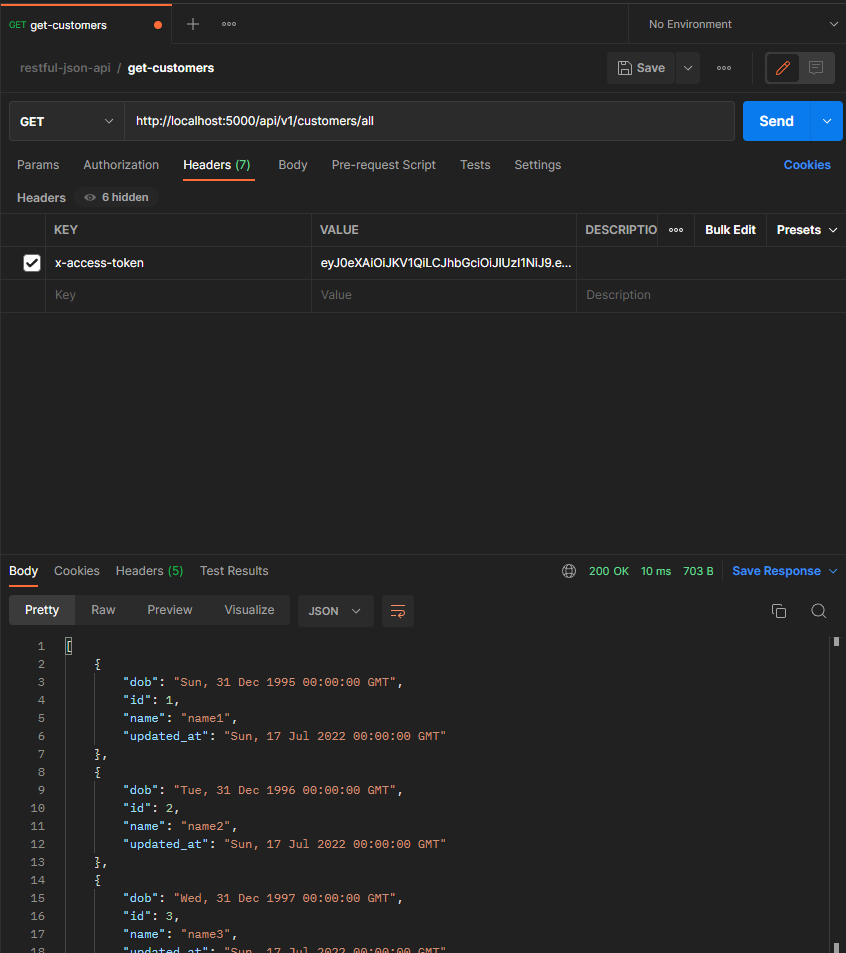

The `updated_at` field will be filled in by the API once customer is __created__ / __updated__ via [create-customer](#create-customer) / [update-customer](#update-customer)
___
## get-customers-size

| INFO   |  |
| -------- | -------- |
| METHOD   | `GET` |
| ENDPOINT | `/api/v1/customers?size={{customer_size}}` |
| TOKEN    | `required` |

This endpoint will get the list of customer according to given size, for example `?size=10` ordered by youngest age after > `Send`

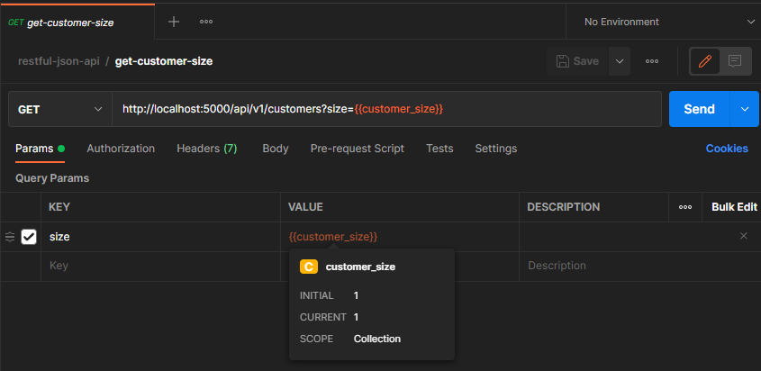
___
## get-customer

| INFO   |  |
| -------- | -------- |
| METHOD   | `GET` |
| ENDPOINT | `/api/v1/customer?id={{customer_id}}` |
| TOKEN    | `required` |

This endpoint will get a specific customer with id given, for example `?id=1` > `Send`


___
## update-customer

| INFO   |  |
| -------- | -------- |
| METHOD   | `PUT` |
| ENDPOINT | `/api/v1/customer?id={{customer_id}}` |
| TOKEN    | `required` |

This endpoint will update the record of a specific customer with id given, for example `?id=1` > `Send`


___
## delete-customer

| INFO   |  |
| -------- | -------- |
| METHOD   | `DELETE` |
| ENDPOINT | `/api/v1/customer?id={{customer_id}}` |
| TOKEN    | `required` |


This endpoint will update the record of a specific customer with id given, for example `?id=1` > `Send`

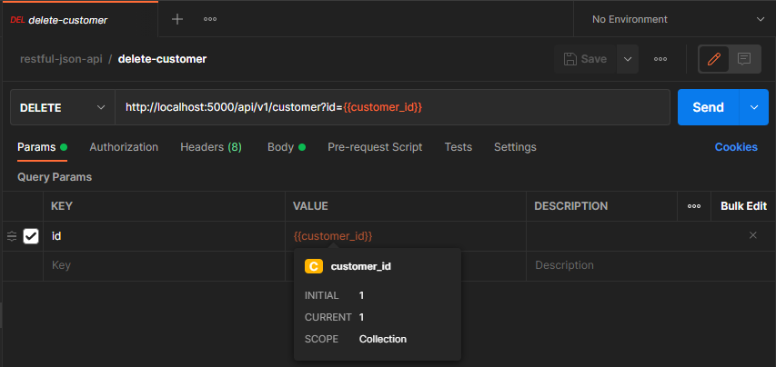
